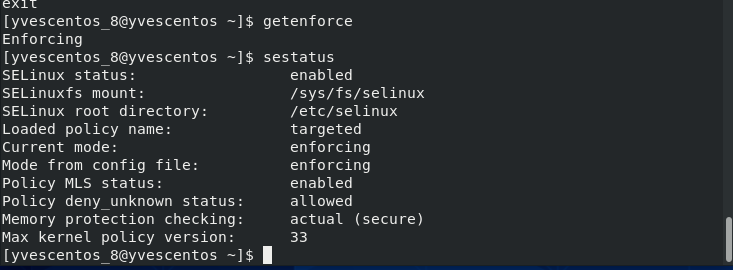
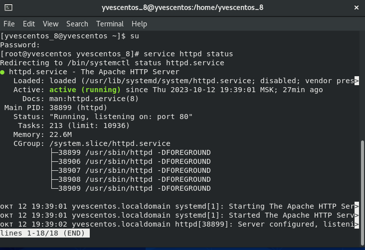
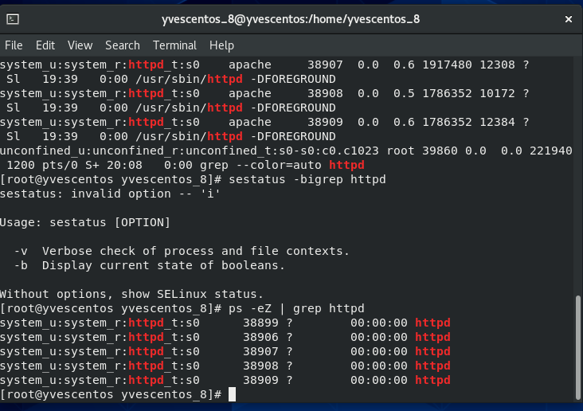
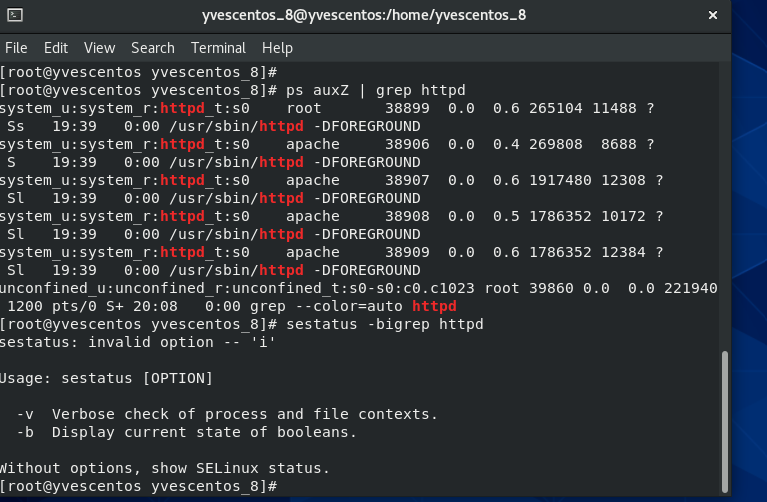
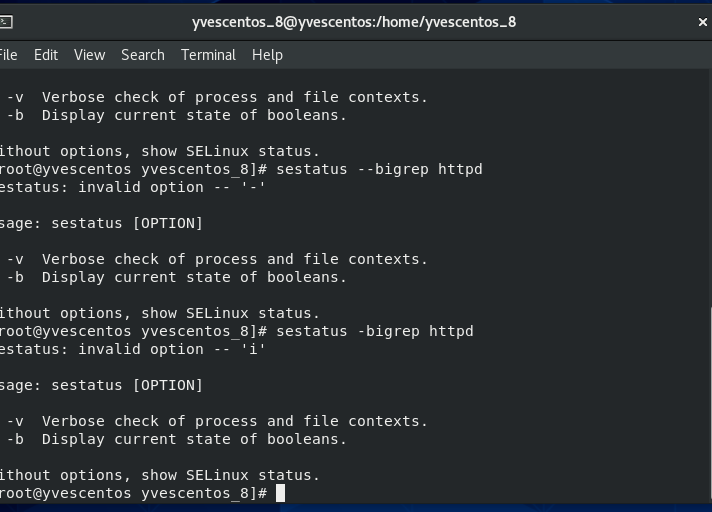
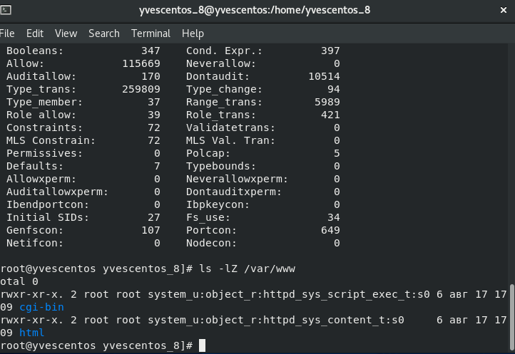
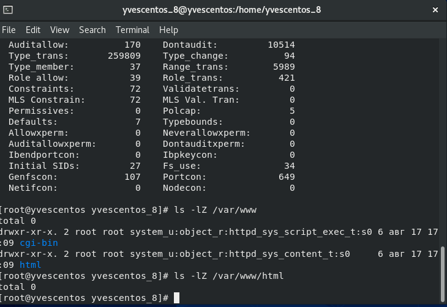
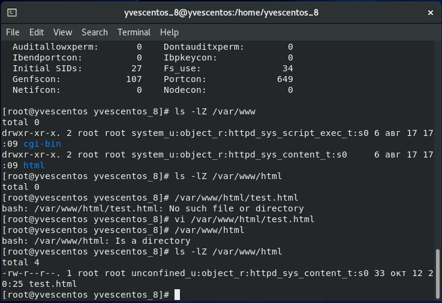

---
# Front matter
lang: ru-RU
title: "Лабораторная работа № 6. Мандатное
разграничение прав в Linux"
author: "Ндри Ив Алла Ролан"
group: NFIbd-02-20
date: 2023 Sep 12th

# Formatting
toc: false
slide_level: 2
header-includes: 
 - \metroset{progressbar=frametitle,sectionpage=progressbar,numbering=fraction}
 - '\makeatletter'
 - '\beamer@ignorenonframefalse'
 - '\makeatother'
aspectratio: 43
section-titles: true
theme: metropolis

---

#  Цель работы

Развить навыки администрирования ОС Linux. Получить первое практическое знакомство с технологией SELinux1.
Проверить работу SELinx на практике совместно с веб-сервером
Apache

## Результат выполнения лабораторной работы

## Результат выполнения лабораторной работы

## Результат выполнения лабораторной работы

## Результат выполнения лабораторной работы

## Вывод 

Развитие навыков администрирования Linux. Получение начальных практических знаний о технологии SELinux1. Проверка работы SELinx на практике с помощью Apache
Веб-сервер Apache.