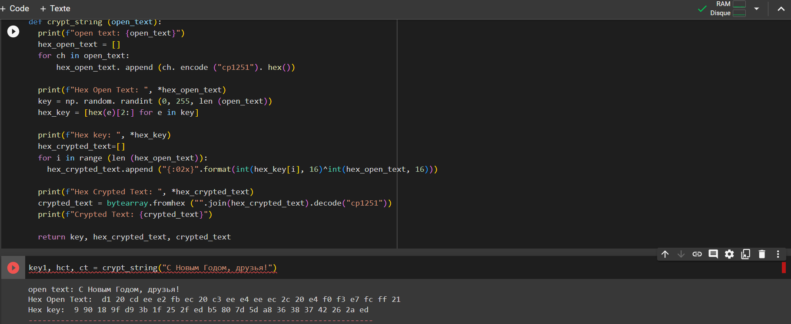

---
# Front matter
lang: ru-RU
title: "Лабораторная работа № 7. Элементы
криптографии. Однократное гаммирование"
author: "Ндри Ив Алла Ролан"
group: NFIbd-02-20
date: 2023 Sep 12th

# Formatting
toc: false
slide_level: 2
header-includes: 
 - \metroset{progressbar=frametitle,sectionpage=progressbar,numbering=fraction}
 - '\makeatletter'
 - '\beamer@ignorenonframefalse'
 - '\makeatother'
aspectratio: 43
section-titles: true
theme: metropolis

---

#  Цель работы

Освоить на практике применение режима однократного гаммирования

## Результат выполнения лабораторной работы

## Вывод 

в данной работе мы освоили практическое применение одиночного гамма-режима